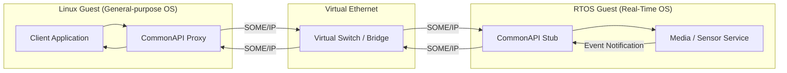

# Automotive Distributed Systems Research

## Research Focus

This repository explores system-level challenges in modern automotive distributed systems, particularly:

- Cross-OS communication under hypervisors
- Deterministic system design in RTOS environments
- Scalable debugging and log analysis

The goal is to analyze trade-offs between different system architectures and identify opportunities for improving reliability and performance.

## System Architecture Diagram

See `diagrams/architecture.md` for detailed analysis.

## Topics Covered

### 1. Cross-OS Communication (SOME/IP)
- Service-oriented IPC between RTOS and Linux guests
- CommonAPI abstraction
- Trade-offs vs shared memory

👉 docs/someip-cross-vm.md

---

### 2. Immutable RTOS Image Design
- Deterministic boot
- Reproducible builds
- System integrity

👉 docs/rtos-image.md

---

### 3. Log Analysis & Automated Detection
- Pattern-based anomaly detection
- Heuristic rules for embedded logs
- Tooling for debugging at scale

👉 docs/log-analysis.md

---

## Motivation

Modern automotive systems require reliable communication across isolated domains, deterministic system behavior, and scalable debugging approaches.  

This repository explores these challenges from a system-level perspective.

---

## Future Work

- Shared memory IPC vs SOME/IP benchmarking
- Deterministic scheduling analysis
- Real-time log monitoring system

---

## Author

Embedded systems engineer focused on real-time platforms, automotive middleware, and system reliability.