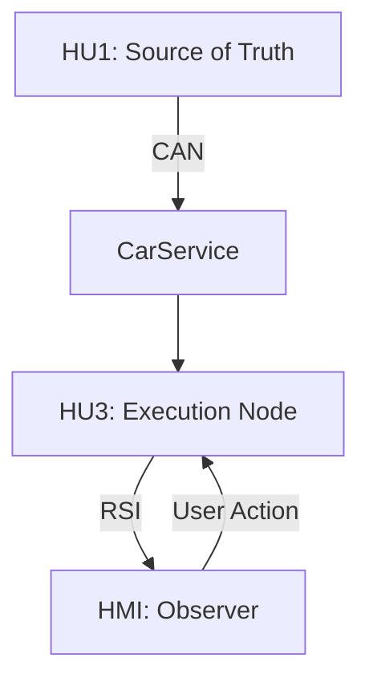
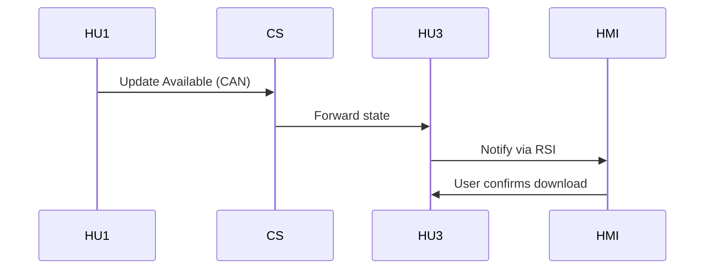

# Automotive Systems as Distributed Systems: A Formal Perspective
**Tags:** `QNX` `Android` `Automotive` `Middleware` `Inter-OS Communication` `Security` `Real-Time` `System Integration`

**Date:** December 2023

**Author:** Automotive Embedded Software Engineer

## Abstract
Modern vehicles are evolving into distributed cyber-physical systems composed of heterogeneous compute nodes communicating over mixed-criticality networks. This article formalizes automotive architectures—focusing on IVI and OTA subsystems—using distributed systems theory. We define a system model, communication abstractions, and consistency/failure properties, and derive design implications for reliable OTA pipelines under real-time constraints.

---

## 1. Problem Statement & Thesis

**Thesis.** Automotive OTA systems should be modeled as distributed systems with explicit state machines to ensure correctness and reliability under real-time and safety constraints.

We study a system comprising nodes {HU1, HU3, HMI} interacting via CAN (low-level) and RSI/REST/WebSocket (service layer). The goal is to maintain **consistent update state** while executing a multi-phase OTA workflow.

---

## 2. System Model

### 2.1 Nodes and Roles
- **HU1**: source of truth for update availability and ECU state
- **HU3**: execution node (download + installation)
- **HMI**: observer/controller (user-triggered actions)

We define the system as:

$$
\mathcal{S} = (N, C, \Sigma, T)
$$

Where:

- $N$: set of nodes  
- $C$: communication channels (e.g., CAN, RSI)  
- $\Sigma$: global system state space  
- $T$: transition relation between states  
---

### 2.2 Communication Channels

**CAN (deterministic bus)**
- bounded latency
- broadcast semantics
- limited payload

**RSI / REST**
- service-oriented abstraction
- request/response

**WebSocket**
- event-driven communication
- push-based updates

---

## 3. Formal State Representation

Each node $n_i \in N$ maintains a local state $s_i \in \Sigma_i$.

The global system state is defined as:

$$
\Sigma = \Sigma_{HU1} \times \Sigma_{HU3} \times \Sigma_{HMI}
$$

Consistency condition:

$$
\forall i, j: f(s_i) = f(s_j)
$$

where $f$ is a projection function over the update state.

---

## 4. Consistency Model

### Strong Consistency
- All nodes observe identical state instantly
- Not feasible in automotive systems

### Eventual Consistency (Adopted)
- Nodes converge over time
- Temporary inconsistency is allowed

**Implication:**
- System must guarantee convergence
- Requires validation mechanisms

---

## 5. Failure Model

We consider:

- **Crash faults**: node stops (HU3 reboot)
- **Omission faults**: lost CAN messages
- **Timing faults**: delayed communication

Assumptions:
- no Byzantine faults
- bounded delay

---

## 6. Invariants (Safety Properties)

1. **No installation before download completes**

$$
state = INSTALLING \Rightarrow download-complete = true
$$

---

2. **Single active update**

$$
\forall t:\; |active-updates(t)| \le 1
$$

---

3. **Valid state transitions**

$$
(state_t, state_{t+1}) \in T
$$

## 7. Architecture Diagram


---

## 8. Sequence (OTA Initiation)



---

## 9. Design Implications

* Prefer **eventual consistency with validation checks**
* Use **explicit state machines** for coordination
* Separate **control plane (RSI)** and **data plane (CAN)**
* Design for **failure recovery and idempotency**

---

## 10. Conclusion

Viewing automotive OTA systems as distributed systems provides a rigorous framework for reasoning about correctness, consistency, and reliability. This foundation enables formal verification and scalable system design for next-generation software-defined vehicles.

````
