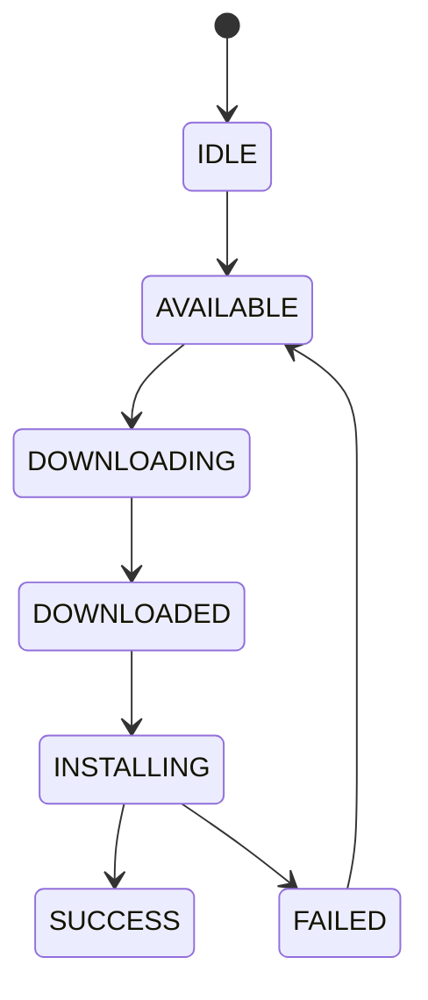

# Designing a Formal State Machine for Automotive OTA Systems

## Abstract
OTA update systems require precise coordination across distributed nodes. This article presents a formal state machine model for automotive OTA systems, including transitions, invariants, and correctness properties.

---

## 1. Problem Statement

OTA systems must ensure:
- correctness under failure
- deterministic transitions
- safe execution under constraints

We model OTA as a **Finite State Machine (FSM)**.

---

## 2. State Definition

Let the set of states be:

S = {IDLE, AVAILABLE, DOWNLOADING, DOWNLOADED, INSTALLING, SUCCESS, FAILED}

---

## 3. Transition System

We define transitions as a relation:

T ⊆ S × S

Core transitions:

- IDLE → AVAILABLE  
- AVAILABLE → DOWNLOADING  
- DOWNLOADING → DOWNLOADED  
- DOWNLOADED → INSTALLING  
- INSTALLING → SUCCESS  
- INSTALLING → FAILED  
- FAILED → AVAILABLE  

---

## 4. State Machine Diagram

## 5. Guard Conditions

State transitions are constrained by **preconditions (guards)** to ensure safety.

The transition to `INSTALLING` is allowed only if:

- `download_complete = true`
- `battery_ok = true`
- `vehicle_stationary = true`

These guards enforce that installation occurs only under safe and valid system conditions.

---

## 6. Invariants

The system must satisfy the following invariants at all times:

### 6.1 Installation Requires Download

INSTALLING ⇒ DOWNLOADED

A system must never enter the INSTALLING state unless the update has been fully downloaded.

---

### 6.2 Single Active Update

|active_updates| ≤ 1

At any time, only one update process may be active to avoid state conflicts.

---

### 6.3 Valid Transitions Only

(s_i, s_j) ∈ T

All state transitions must belong to the predefined transition set T.

---

## 7. Idempotency

State transitions must be **idempotent**, meaning repeated execution does not alter correctness.

- Re-triggering `INSTALLING` must not corrupt system state
- Retry operations must preserve consistency

This property is essential for handling retries and partial failures.

---

## 8. Failure Handling

### 8.1 Non-Fatal Failures

Examples:
- Battery low
- Charging active
- Parking condition violated

**Handling strategy:**
- Pause or rollback state
- Allow retry after condition recovery

---

### 8.2 Fatal Failures

Examples:
- ECU crash
- Corrupted update package

**Handling strategy:**
- Abort update process
- Require manual intervention (e.g., workshop recovery)

---

## 9. Correctness Properties

### 9.1 Safety

The system must never reach an invalid or undefined state.

---

### 9.2 Liveness

The system must eventually reach a terminal state:

- SUCCESS, or
- FAILED

This guarantees that the update process does not stall indefinitely.

---

## 10. Design Implications

- Finite State Machines simplify reasoning and debugging
- Enable future formal verification (e.g., model checking)
- Provide structured recovery mechanisms for failure scenarios

---

## 11. Conclusion

A formally defined state machine is essential for designing reliable OTA systems in distributed automotive environments. It ensures correctness, supports robust failure handling, and establishes a foundation for formal verification.
