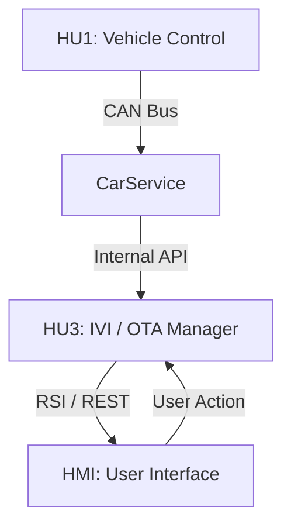

# System Architecture: Distributed OTA in Automotive Systems

## Overview

This architecture models an automotive OTA system as a distributed system composed of multiple interacting nodes.

**Nodes:**
- HU1: Source of truth (vehicle control unit)
- HU3: Execution node (IVI system)
- HMI: User interface
- CarService: Communication bridge

---

## Architecture Diagram

Communication Model
CAN Bus
Low latency
Deterministic
Broadcast communication
RSI / REST
Service-oriented communication
Request-response model
WebSocket (Event-driven)
Push-based updates
Real-time synchronization
Design Insight
Separation of concerns:
Control plane: RSI / REST
Data/state plane: CAN
Loose coupling between nodes
Event-driven synchronization
Implications

This architecture reflects a distributed system under real-time constraints where:

Nodes operate asynchronously
State must be synchronized
Failures must be tolerated safely
