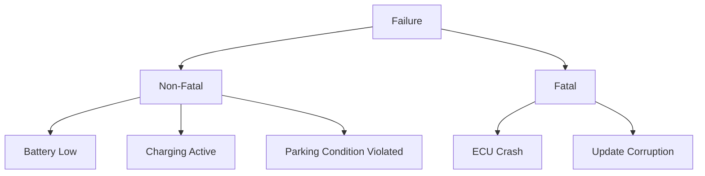
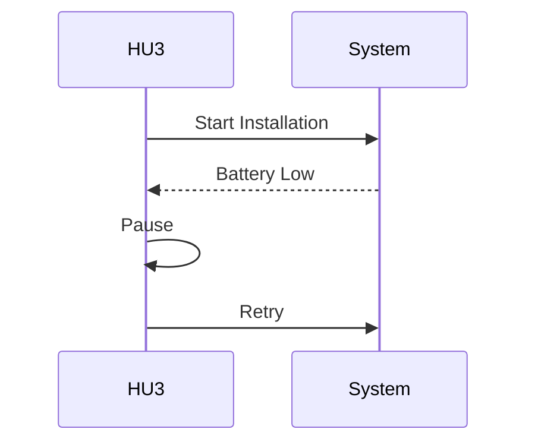

---
# Fault Model for Automotive OTA Systems

## Overview

This document defines the failure model for OTA systems in automotive environments.

---

## Fault Classification

## Failure Types

### Non-Fatal Failures

**Characteristics:**
- Temporary
- Recoverable

**Examples:**
- Battery low
- Charging state
- Unsafe vehicle condition

**Handling:**
- Pause execution
- Retry after recovery

---

### Fatal Failures

**Characteristics:**
- Critical
- Not recoverable at runtime

**Examples:**
- ECU crash
- Corrupted update package

**Handling:**
- Abort process
- Require manual intervention

---

## Failure Timeline

---

## Design Implications

- Distinguish between recoverable and unrecoverable faults
- Support retry for non-fatal failures
- Enforce safe abort for fatal failures

---

## Distributed System Perspective

This fault model aligns with classical distributed system failure types:

- Crash faults
- Omission faults
- Timing faults

---

## Conclusion

A well-defined fault model is essential for:

- Reliable OTA systems
- Predictable system behavior
- Safe recovery strategies
