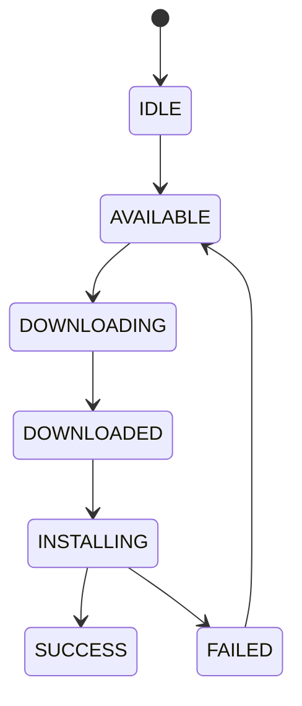

---

# 📄 `diagrams/ota_state_machine.md` (fixed)

```md
# OTA State Machine (Formal Model)

## Overview

This diagram represents the OTA update lifecycle as a Finite State Machine (FSM).

---

## State Machine Diagram


Failure-aware Transitions

Properties
Determinism

Each state has well-defined transitions.

Safety

Invalid transitions are not allowed.

Liveness

The system eventually reaches:

SUCCESS, or
FAILED
Design Insight
FSM provides explicit control flow
Enables verification of valid transitions
Supports idempotent retry mechanisms
Implications

The OTA process can be analyzed as a transition system, enabling:

correctness reasoning
fault recovery strategies
system validation
